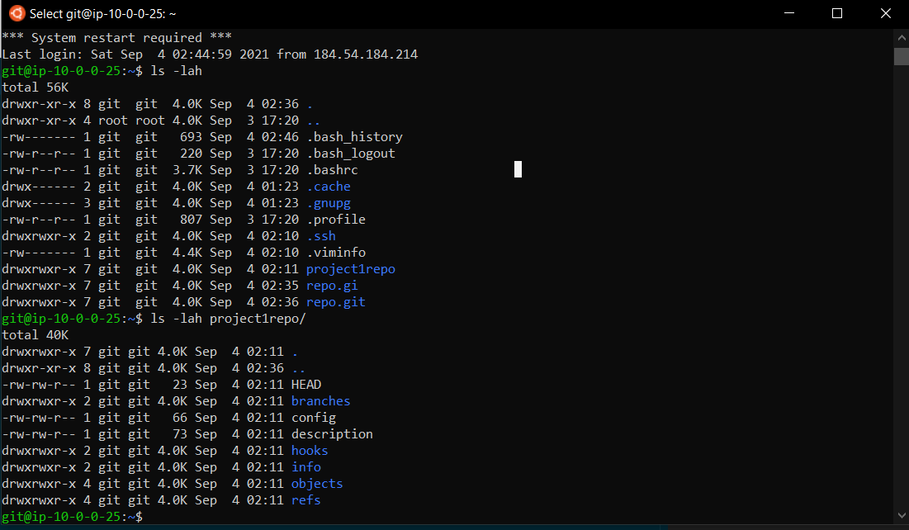
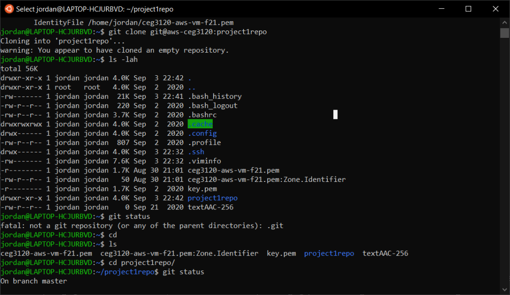

# Project 1

**Setup: how to initialize a repo and all other setup steps (users, permissions, keys)**

- On our AWS instance (server) we used the "git init" and or "git init --bare" command to initialize our repository.

- After generating an ssh key, we want to ensure that we are the only ones to have r/w permissions on it so that we can continue with the ssh connection.

- Once that was done we used "adduser git" in order to create the user we would use to clone on our local system from the AWS instance.

- Sudo su into git and created folders for our ssh key connection those being (authorized_keys as well as a config folder so we would be able to ssh into the server using "git" user) 

- I chose to navigate to my .ssh/authorized_keys folder in my server client and copy the public key from there. I then took that copied key and pasted it into a .ssh/authorized_keys folder on my git user's client. Once that was done it was just a matter of creating an ssh config that allowed for the connection.

**Usage: how to clone, add, commit, and push from a given system to the repo hosted on the AWS instance**

- git clone was used on the local system to point to the existing repo on our AWS instance and make a copy of it on our local system.
    - git clone desc. - used to clone a repository into a new directory

- git init was used to create (initialize) a repository once we were signed into the "git" user , that we would then pull onto our local system using git clone.
    - git init has some variations, more importantly git init v.s. git init --bare

        - git init creates a repository with a working directory
        - git init --bare creates a repository without a working directory. (just puts everything in the normal directory)

- git add was used to get our changes in the repository ready for staging in the next commit. Essentially, it tells git what you are wanting to include in your next "git commit" command.

- git commit was used to record the changes we had made to the repository that have been staged using the git add command. It is used to capture somewhat of a snapshot of the repositories most recently staged changes that have been added for staging.

- git push was used to upload everything that had been commited on our local repository to the remote repository. This command is used to transfer local commits to a remote repo. (In our case maybe our AWS Instance or github.com)

**Proof: include screenshots of the repo**

- existing on the AWS instance 

- being cloned to your local system

