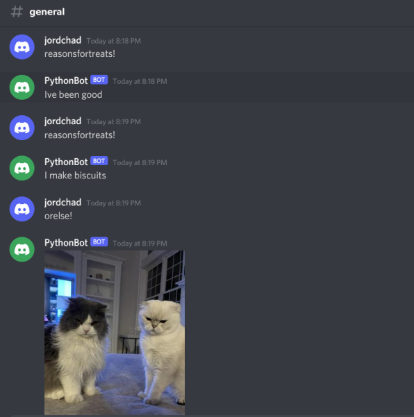

# Project 2

**Setup:**
- Description of Bot
    -A bot is an automated program (in our case one that acts like a user on discord in a server)
    -These bots respond to events / commands on Discord

- How to get an API ?
    - To get an API (in our case the discord bots tokens)
    - 1. Create a bot user and guild (refer to "Creating a bot section of "realpython" guide)
    - 2. On the Developer Portal for Discord select OAuth2 page and generate authorization URL (refer to "Adding a bot to a guild" in guide)

- Where to put it to work with the code
    - Navigate to Bot section in Discord Developer Portal and copy bot's token.
    - In the same directory as your bot.py code create a .env file
    - Paste your token in this format: 
    DISCORD_TOKEN=your-bot-token
    DISCORD_GUILD=your-guild-name
    - Refer to "Creating a Discord Connection " and "Interacting With Discord APIs" in guide

- Dependencies (what packages need to be installed to run the code)
    - In-Order to run the code you will need to install these packages:
        - apt install python3
        - apt install python3-pip
        - pip3 install -U discord.py (Python library that implements Discord's API's)
        - pip3 install -U python-dotenv (Library that helps with working with .env files)
        

**Usage:**
- With your changes to the code in place, describe
    - I modified the original to :if message.content == 'reasonsfortreats!':
         response = random.choice(meow)
        - This randomly pulls from a list of quotes labeled meow 
    - Additonally, I instered :  if message.content == 'orelse!':
        await message.channel.send(file=discord.File('givemetreats.png'))
        - This responds with a .png image to a command

- What commands you can type in your Discord server / What response this will provide (from your bot)
    - reasonsfortreats! - pulls a random quote from meow
    - orelse! - responds with an image of some demanding kitties

**Research:**
- There are a couple of different ways in regards to keeping your Discord bot "always on". 
    - Using a Virtual Private Server to host the bot 24/7
    - Running bot on a Cloud
    - Using something like a raspberry pi to host the bot 
    - There are even ways of using IDE's to keep the bot going at all times.

- All of these methods should work due to allowing the bot to be on a computer powering it at all time. Any hosting device, which allows for the file to be powered so that python3 bot.py is kept running. 
