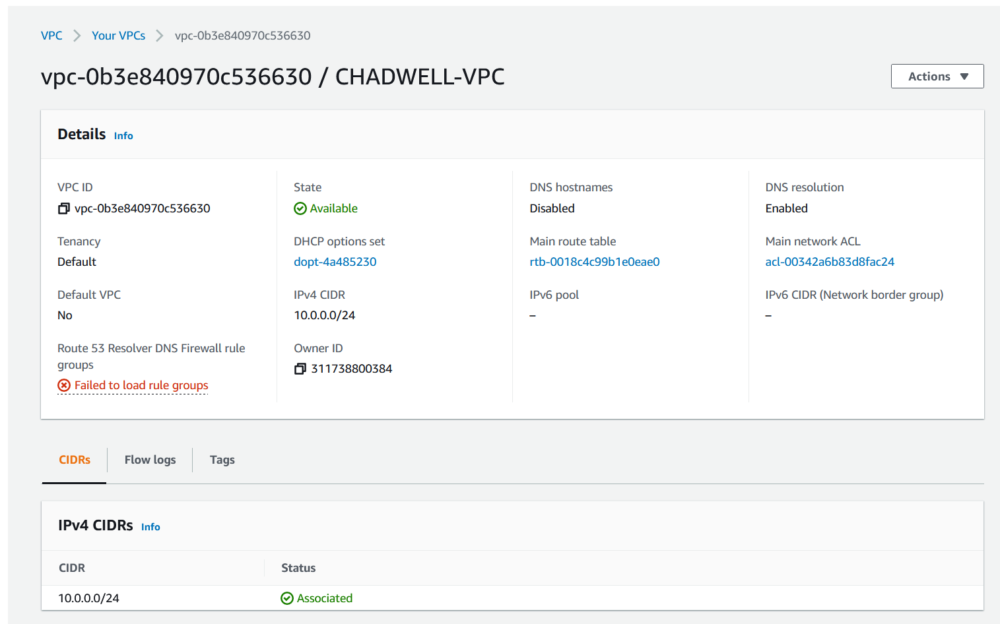
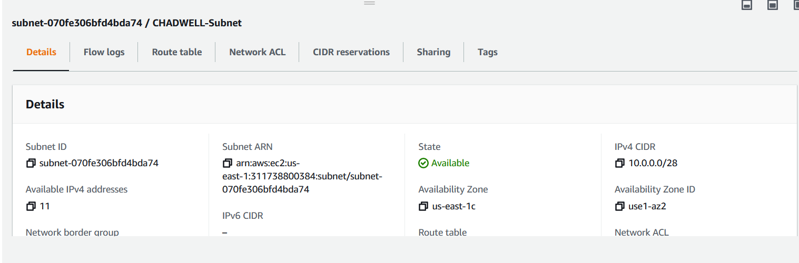
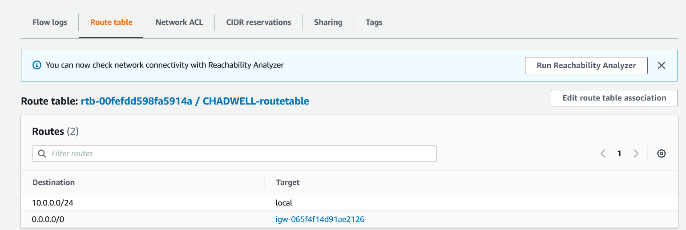
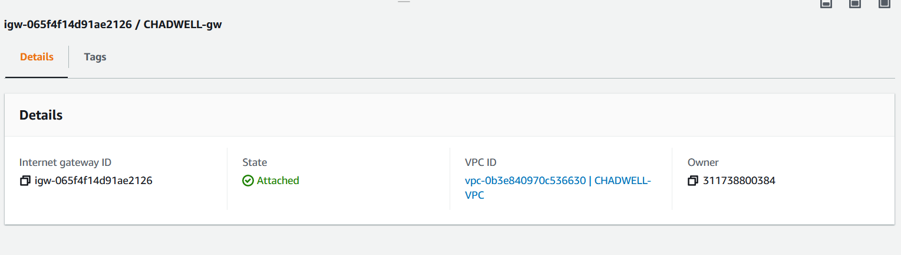
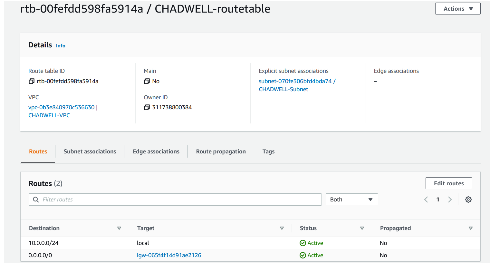
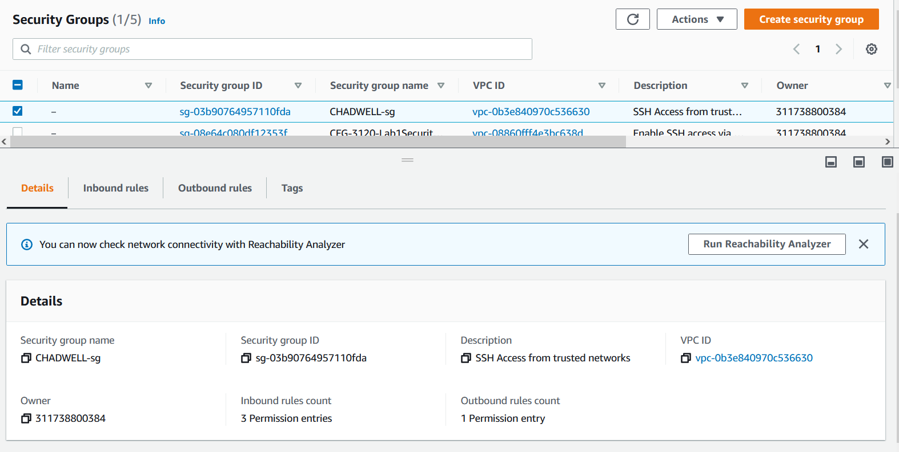
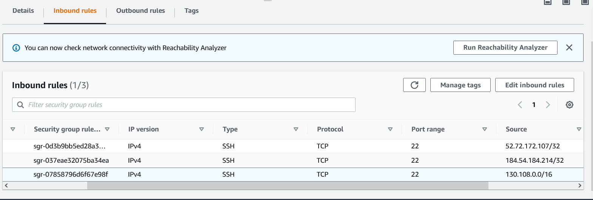
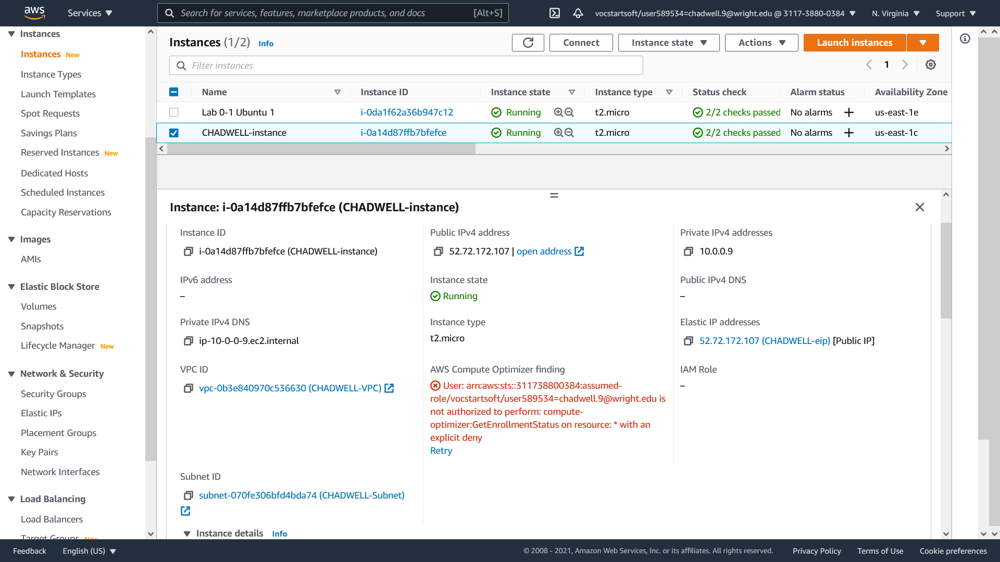
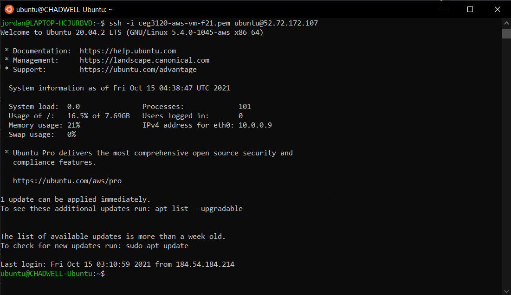

# Part 1 - Build a VPC

**1.Create a VPC.**

- VPC is a Virtual Network Cloud dedicated for our AWS accounts. It allows for launching of AWS recourses into a virtual network. Resembles a traditional network.

 **2.Create a subnet.**

- Subnet is an ip used to split a large network into a smaller grouping of networks, this helps with minimizing traffic. Public will be used to connect to internet, where as private used for not connecting to internet. Essentiall a subnet is a range of IP addresses in the VPC.

 **3.Create an internet gateway**
 
 - Provides a target for our VPC route tables to guide through internet traffic. Additionally, it performs network address translation (NAT). They are used with assigned IP addresses.

**4.Create a route table**
 
 - Used to determine where network traffic from our subnet / gateway is directed. Directs packets which way to go to get to the destination.

**5.Create a security group**
 
 
 - Acts as a virtual firewall for our instance. It controls ingoing and outgoing traffic through our instance. It is a set of inbound rules and outbound rules that direct incoming traffic and outgoing traffic. 

 # Part 2 - EC2 instances

 **1.Create a new instance. Give a write up of the following information:**
 - AMI selected: Ubuntu Linux/UNIX AMI
    - default username of the instacnce type selected: ubuntu
 
- Instance type - t2.micro

 **2.Attach the instance to your VPC. As discussed there are different pathways to doing this. Say how you did it.**
 - On step 3 of setting up the instance "Configure Instance Details" we are able to select our previously made VPC, which is in the "Network" selection. Additionally, we slect our subnet. This attaches the VPC with our instance

  **3.Determine whether a Public IPv4 address will be auto-assigned to the instance. Justify your choice to do so (or not do so)**
  - We should not auto-assign IP when creating the instance. This is due to AWS potentially assigning and re-assigning a different IP at any time. Furthermore, we will be configuring / reserving an Elastic IP that will be associated with the instance. This IP will be static and will not have the chance of changing.

  **4.Attach a volume to your instance. As discussed there are different pathways to doing this. Say how you did it.**
  - In step 4 of instance creation "Add Storage" we are able to select the storage volume based off of what we had selected earlier. You have the options of multiple choices for volume types. This will attach the selected volume with the instance.

  **5.Tag your instance with a "Name" of "YOURLASTNAME-instance". Say how you did it..**
  - Upon step 5 of instance creation you have the option to create a tag to go with your newly created instance. For my case, I used CHADWELL-instance.

  **6.Associate your security group, "YOURLASTNAME-sg" to your instance. Say how you did it.**
  - In step 6 of configuring our new instance, instead of creating a new security group we can select the SG we created in part 1 of project3. I selected CHADWELL-sg that I configured in part 1.

 **7.Reserve an Elastic IP address. Tag it with "YOURLASTNAME-EIP". Associate the Elastic IP with your instance. Say how you did it.**
 - In AWS services navigate to "Elastic IPs". Then I allocated an Elastic IP address named CHADWELL-eip. Then clicking on our newly created elastic IP and clicking Actions>Associate Elastic IP address. For resource type - Instance and then we are able to choose our instance for the elastic IP to be associated with.

 **8.Create a screenshot your instance details and add it to your project write up. Example below:**
  

**9.How to change hostname via commands on instance**
- Before changing I copied /etc/hostname to a hostname.old file incase of issues. I then ran the commands:
- sudo hostname CHADWELL-Ubuntu
- sudo hostnamectl set-hostname CHADWELL-Ubuntu

**10.Screenshot of successful SSH connection to instance (with your new hostname instead of ip-##-##-##-##)**
  

 

