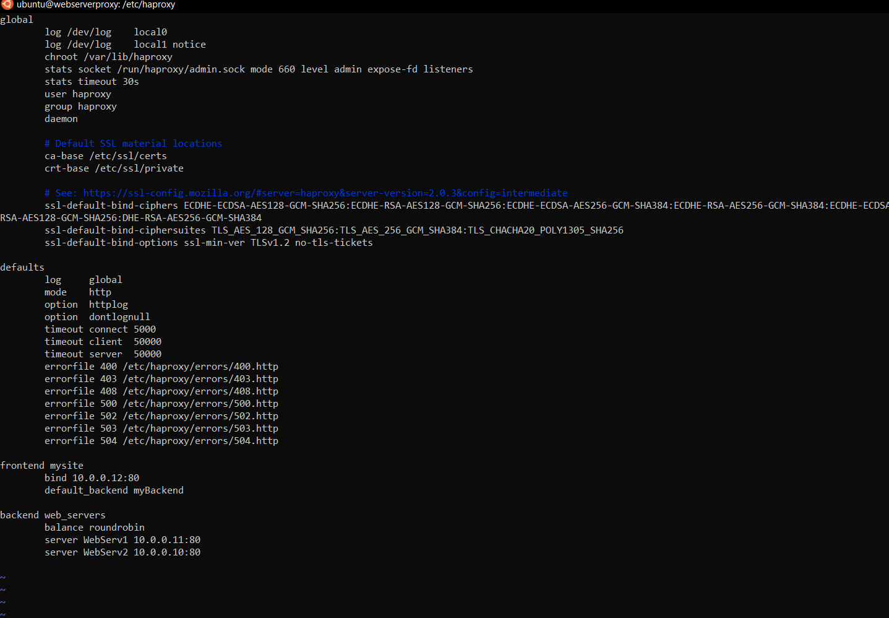
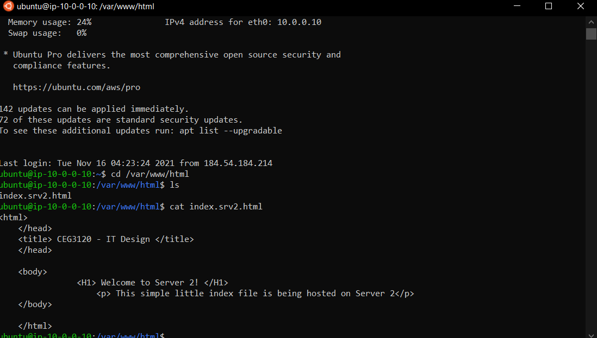
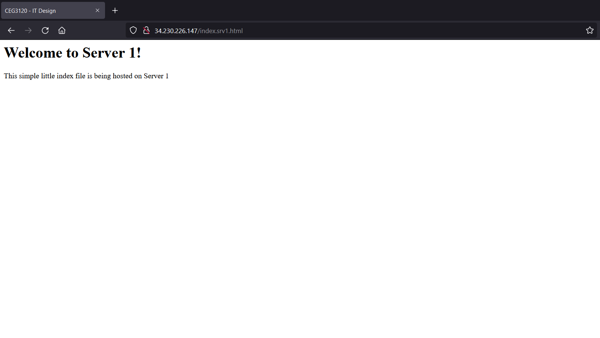
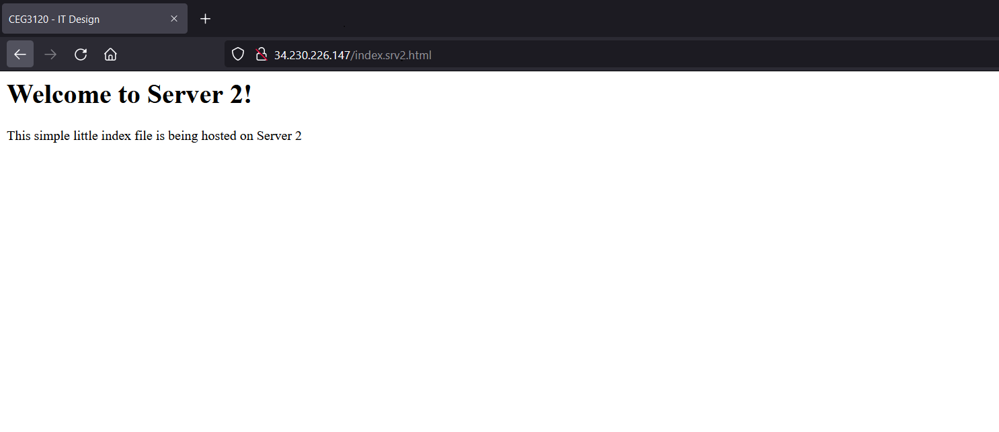

# Project 5

# Part 2 - Setup Load Balancing TODOs

**1.Create an /etc/hosts file on each system that correlates hostnames to private IPs. Description of how file is configured**

- Added following to /etc/hosts, on each system: [IP Private, Hostname]

    - 10.0.0.12 webserverproxy
    - 10.0.0.11 WebServ1
    - 10.0.0.10 WebServ2

**2.Document how to SSH in between the systems utilizing their private IPs.**
- To SSH in between the systems with their private IPs. Use command ssh -i (key associated) (hostname connecting to) "webserverproxy, WebServ1, WebServ2"

**3.HAProxy configuration & documentation requirements ( / 5)**

 - **How to install package**
    - apt-get install -y haproxy in template. Could use sudo apt install haproxy in terminal

 - **What file(s) where modified & their location**
    -On the proxy server, modified the haproxy.cfg file @ /etc/haproxy/haproxy.cfg as shown:
    

 - **What configuration(s) were set (if any)**
    - In addition to editing some of the configs, I created a frontend section as well as a backend section. As explained in https://www.haproxy.com/blog/the-four-essential-sections-of-an-haproxy-configuration/

-  **How to restart the service after a configuration change**
    - sudo systemctl reload haproxy.service

- **Resources used (websites)**
    -  https://www.haproxy.com/blog/the-four-essential-sections-of-an-haproxy-configuration/

**4.Webserver 1 & 2 configuration & documentation requirements**

- **How to install package**
    -  apt-get install -y git apache2 && \ in template, Could use sudo apt install apache2 in terminal.
- **What file(s) where modified & their location**
    - On each webserver server, modified the index.html to index.srv1.html and index.srv2.html file on each server @ //var/www/html/index.html as shown:
    
- **What configuration(s) were set (if any)**
    -
- **How to restart the service after a configuration change**
    -sudo systemctl reload apache2.service
- **Resources used (websites)**
    - https://www.digitalocean.com/community/tutorials/how-to-install-the-apache-web-server-on-ubuntu-20-04

**5.From the browser, when connecting to the proxy server, take two screenshots. ( / 2)**
- one screenshot that shows content from "server 1"

- one screenshot that shows content from "server 2"

